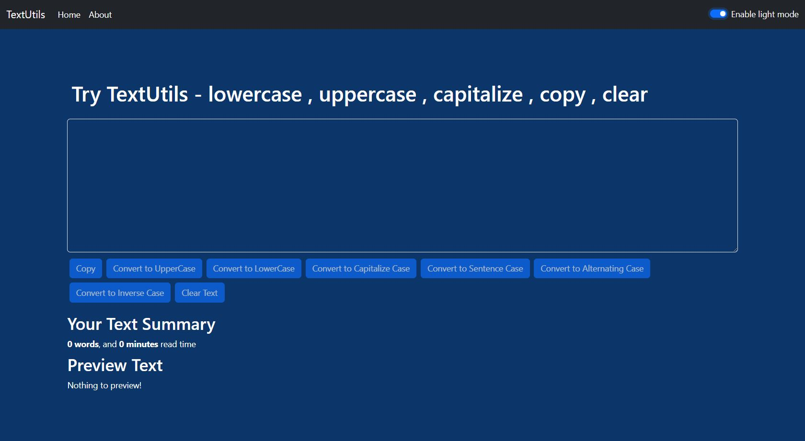
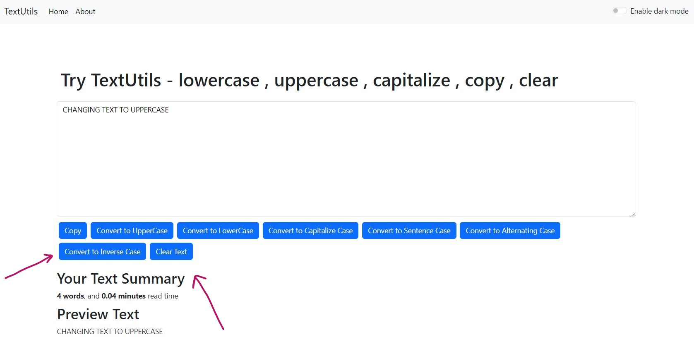

# TextUtils - React base Application

TextUtils is a Application that helps user falcilate them with useful features to modify their text as per their desire.

## Change Case 

### `UpperCase` , `LowerCase` 

User can change case of text either to uppercase or to lower case which will facilate them in many times whenever modifying their text. 

## Sentence Case, Inverse Case, Alternate Case, Capitalize 

### Some additional features that make much ease for user

With help of all these features, a user can try multiple case transformations on its text, and can have of it's own choice.

## Clear Text, Copy Text

### Clear and Copy text on a button click

User can copy or clear all text mentioned, no matter how long it is. All this is just because of amaxing features of TextUtils.

## Calculate Text Length & Preview Text

### Text Summary

Text summary includes preview of the text, text length,and read time as per text length.

## Toggle Mode Feature 

### Light and Dark Modes

User can switch to either light or dark mode according to his will.

### `Dark Mode`

### `Light Mode`

